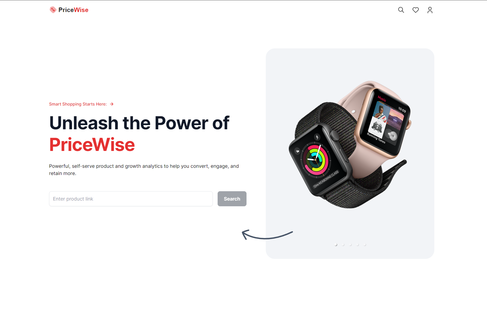
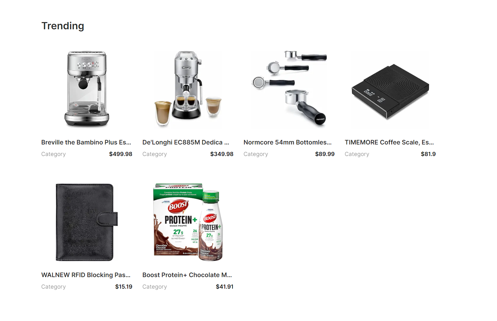
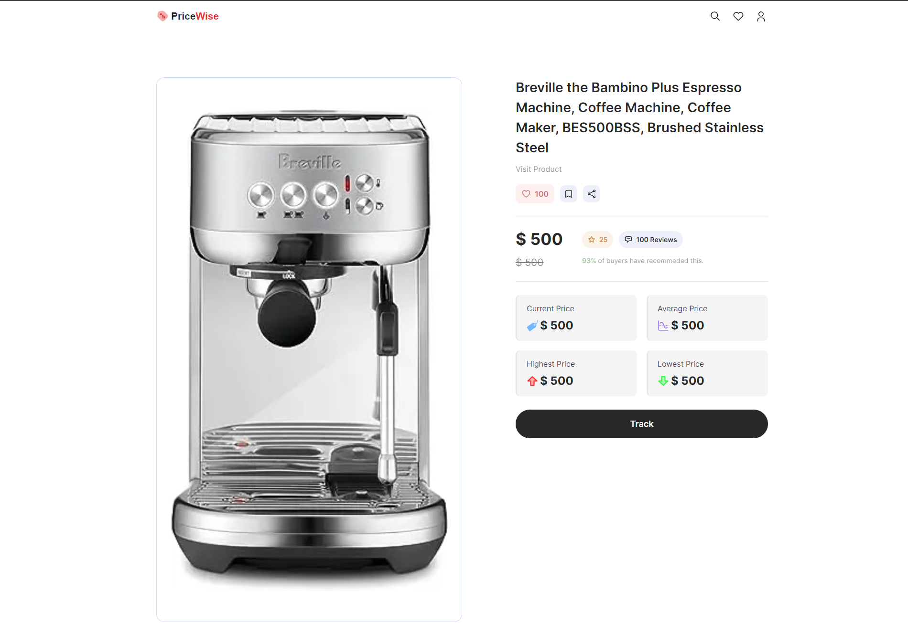
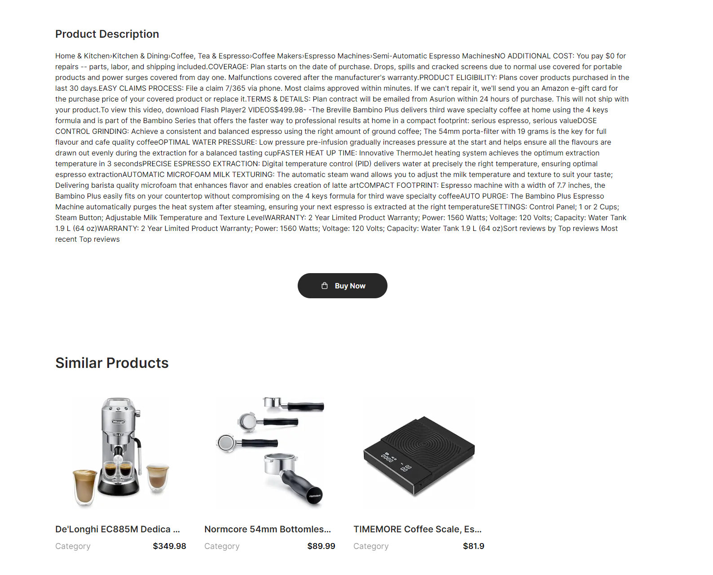

# WebScraper for Amazon product prices.

This is a webscraping app to track amazon product prices to find out if now is a good time to buy the product that you want. With features like historic prices data, user-reviews, ratings, and automatic email notification, users can feel peace of mind knowing they will always get the best price when purchasing a product from Amazon (CA and US).

Visit the deployed application <a href="https://web-scraper-l3ew56ox1-viet-an-truongs-projects.vercel.app" target="_blank">here</a>.

# Overview

### Main UI

# Tech Stack
- Next.js
- TypeScript
- TailwindCSS

### Credits
- JSMastery
- Viet An Truong
